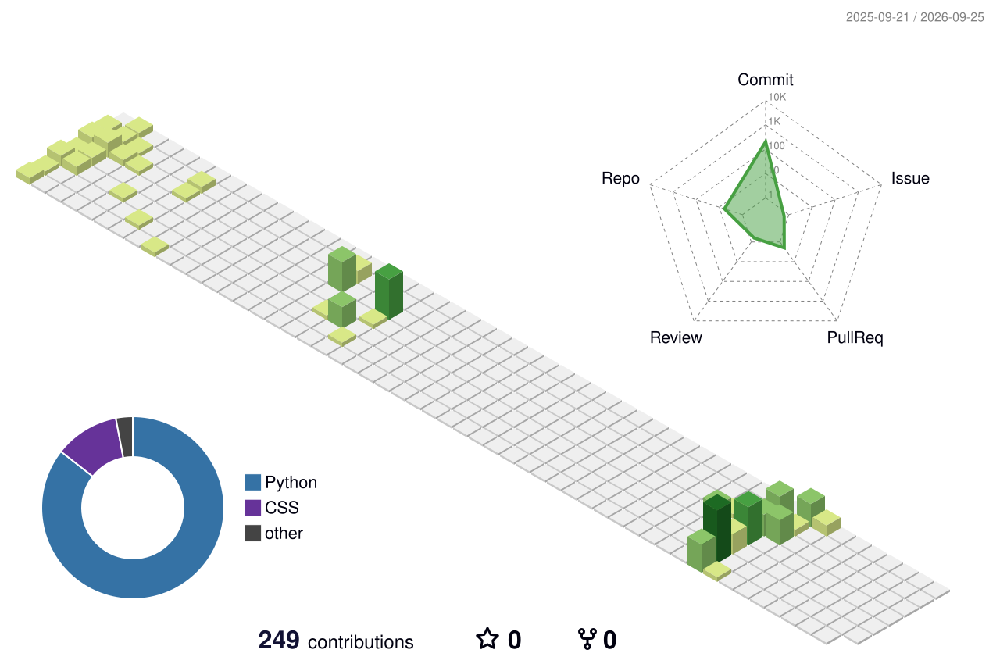

# Hi, I'm Ovidiu :wave:

> *"The sage never tries to store things up. The more he does for others, the more he has. The more he gives to others, the greater his abundance."*  
> — Tao Te Ching <!-- Chapter 81 -->

## Current Projects 

- [PyGraft-gen](https://github.com/Orange-OpenSource/pygraft-gen) &mdash; A library to generate synthetic RDFS/OWL ontologies and RDF Knowledge Graphs at scale

---

  

  
  

<!-- FYI, u can ignore personal repos & stuff on the stats cards but lets keep it for now -->
